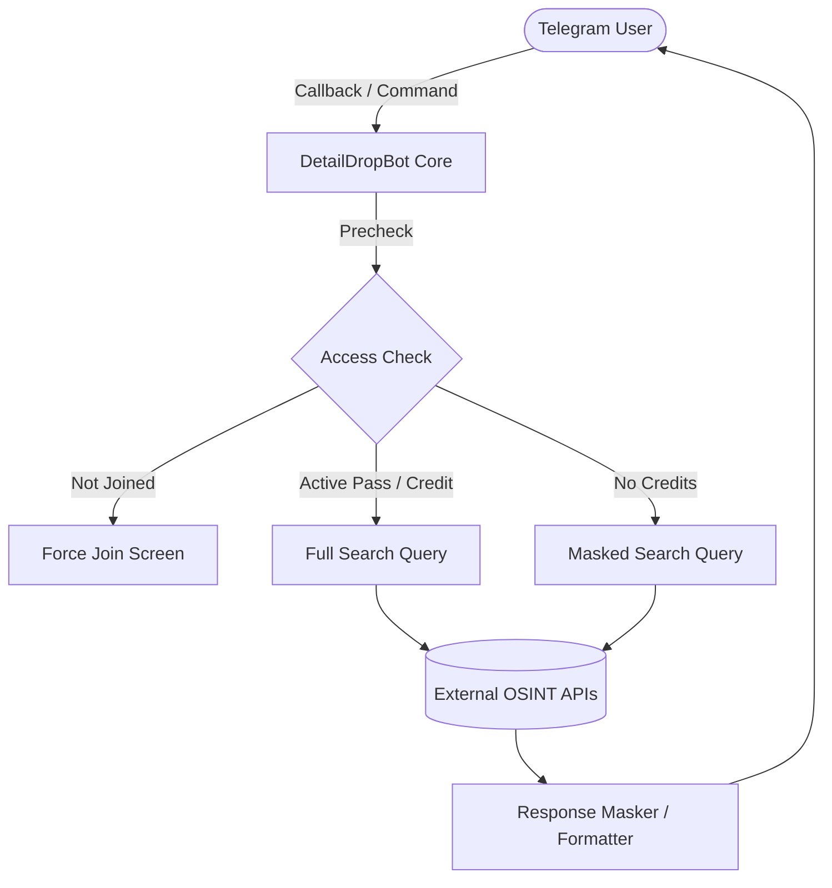

# 🔎 DetailDropBot v3.0

  
  
  
  

---

## 🌟 Overview
**DetailDropBot** is an advanced, multi-source intelligence OSINT Telegram Bot designed to fetch vehicle, mobile, PAN card, leak databases, and bank branch details under a uniform and masked framework.

---

## 🚀 Features

- 📱 **Mobile Lookup:** Name, circle, alternate phone numbers, and addresses.
- 🚗 **Double Vehicle APIs:** Supports fallback routing between two high-performance RTO databases.
- 📄 **PAN Card Lookup:** Name, Father's Name, DOB, Gender, Income and Address.
- 🕵️ **Leak OSINT Search:** Custom Cloudflare tunnel integration for email/phone leak databases with pagination.
- 🏦 **IFSC Bank Lookup:** Complete branch state, MICR, UPI, IMPS, NEFT, and RTGS payment statuses.
- 🎟️ **Promo Codes & Referral System:** Integrated dynamic credit rewards (+2 per referral) and free time-based passes.
- 🔐 **Force Join Verification:** Precise group and channel membership checks with custom top-bar Telegram alerts.

---

## 🛠️ Architecture & Flow

---

## ⚙️ Configuration Variables

To deploy **DetailDropBot**, set the following environment variables:

| Environment Variable | Description |
| :--- | :--- |
| `BOT_TOKEN` | Your Telegram Bot Token from [@BotFather](https://t.me/BotFather) |
| `MONGO_URI` | MongoDB Atlas Connection String |
| `PORT` | Port for Render health-check HTTP server (Default: `8080`) |

---

## 📖 Quick Start Command Guide

### 🔍 Search Engines
* `/mobile <number>` — Search 10-digit mobile number details
* `/vehicle1 <RC>` — Check RTO database (API 1)
* `/vehicle2 <RC>` — Check RTO database (API 2)
* `/pan <PAN>` — Retrieve PAN card record
* `/leak <email_or_phone>` — Scan leak databases
* `/ifsc <IFSC>` — View bank branch payment details

### 👥 User Controls
* `/start` — Launch user menu panel
* `/profile` — View credits, time-passes, and invite link
* `/claim <code>` — Redeem promotional vouchers
* `/checkin` — Claim +1 free daily credit
* `/leaderboard` — Show top referring members

### 👑 Admin Management
* `/admin` — Open statistics dashboard
* `/addcredit <user_id> <amount>` — Add credits
* `/removecredit <user_id> <amount>` — Deduct credits
* `/addpass <user_id> <hours>` — Grant hourly time-pass
* `/addpassdays <user_id> <days>` — Grant daily time-pass
* `/userinfo <user_id>` — Fetch detailed user profile
* `/ban` / `/unban <user_id>` — Suspend/restore access
* `/reply <user_id> <msg>` — Reply to user support tickets
* `/broadcast` (Reply to message) — Send global broadcast
